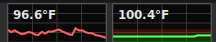

# CPU/GPU Temperature Monitor - Cinnamon Applet

Real-time CPU and GPU temperature monitoring with scrolling line graphs for the Cinnamon desktop panel.

## Screenshot



## Features

- Scrolling Cairo line graphs for CPU and GPU temperature
- VRAM usage bar (green-to-red gradient) on the GPU graph
- Tooltip showing current temps and VRAM usage
- Popup with full-history graphs on left-click
- Configurable graph dimensions, colors, sample rate, and temperature range
- Fahrenheit/Celsius support
- Automatic panel height fitting
- Sensor backends: thermal_zone sysfs, lm-sensors, nvidia-smi, AMD hwmon

## Installation

```bash
git clone https://github.com/bitstrike/cpugpu
cd cpugpu
ln -sf "$(pwd)/cpugpu@bitcrash" ~/.local/share/cinnamon/applets/cpugpu@bitcrash
```

Then restart Cinnamon (Alt+F2, type `r`, Enter) and enable "CPU/GPU Temperature Monitor" in Panel > Applets.

## Configuration

Right-click the applet and select "Configure" to adjust:

- Graph width and height (or auto-fit to panel)
- Sample rate and time range
- CPU/GPU line colors, background, and grid colors
- Temperature range (Y-axis min/max, entered in your chosen unit)
- Fahrenheit/Celsius toggle
- History buffer size

## Requirements

- Cinnamon 4.0+
- For GPU temperature: `nvidia-smi` (NVIDIA) or AMD hwmon sysfs
- For CPU temperature: `/sys/class/thermal/` or `lm-sensors`

## Files

```
cpugpu@bitcrash/        (applet - symlink to ~/.local/share/cinnamon/applets/)
  applet.js             Main applet code
  metadata.json         Applet metadata
  settings-schema.json  Configuration schema
  stylesheet.css        Theme-compatible styles
  icon.svg              Applet icon
```

## License

See [LICENSE](LICENSE).
